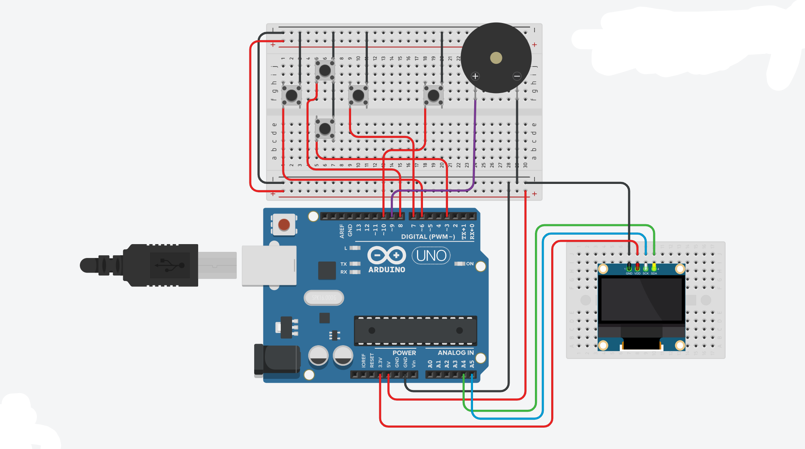

# Arduino-DOOM
DOOM running on an Arduino UNO R3 + 0.96" OLED + 5 Buttons + Buzzer

"it runs DOOM" - on 2KB of RAM

### **Parts**
- **Board**: Arduino UNO R3 
- **Display**: 0.96" SSD1306 OLED 128x64 I2C
- **Controls**: 5x Push Buttons - Movement + Fire
- **Audio**: Passive Buzzer for SFX
- **FPS**: ~4-8 FPS

### **Wiring**
| Component | Arduino Pin |
| --- | --- |
| **OLED GND** | GND |
| **OLED VCC** | 5V |
| **OLED SDA** | A4 |
| **OLED SCL** | A5 |
| **Button Up** | D2 |
| **Button Down** | D3 |
| **Button Left** | D4 |
| **Button Right** | D5 |
| **Button FIRE** | D6 |
| **Buzzer +** | D9 |
| **Buzzer -** | GND |

All buttons use `INPUT_PULLUP`. One side to 5V, other side to pin.

### **Controls**
`D2-D5` = Move / Look  
`D6` = FIRE 

### **Libraries Needed**
1. `Adafruit GFX Library`
2. `Adafruit SSD1306`

### **Coding Notes**
To get the code;

   1. Click the `<>Code` button on top.

   2. Click the `Download ZIP` button(The ZIP file will download).
   
   3. Open the downloaded ZIP file(DOOM_Arduino).
   
   4. Select the folder DOOM_Arduino.

   5. Press the `Extract To` button.

   6. Select the place where you want to move it.

   7. Press the `OK` button.

   8. Open the folder(DOOM_Arduino) in the `File Explorer`.

   9. Open the file `DOOM_Arduino.ino`.
 
   10. Upload the code.

### **NOTES**
- There are another files in the folder, Don't move or delete them(If you move or delete them Arduino IDE will show error massages).
  
- The wiring diagram below.

### **Credits**
Find my other projects from: https://sites.google.com/view/codeandcirkit?usp=sharing

Built by: Thiyon(Code&Cirkit)

### **WIRING** 
### **Wiring Diagram**

